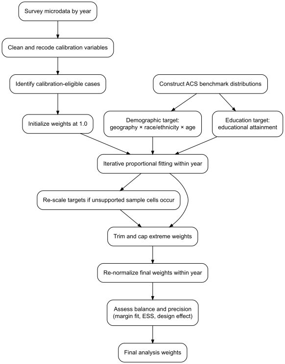

# Code-Demo

This repository prepares Maryland commuter survey microdata for analysis by harmonizing raw variables into standardized, publication-ready fields. It applies consistent recodes for work arrangement, teleworkability, demographic, household, occupational, and geographic measures, and generates weighted descriptive statistics, figures, and multinomial regression outputs. The workflow supports a reproducible end-to-end pipeline in Python, from data cleaning and categorization to weighted tabulation and visualization, and to clustered multinomial modeling of work arrangement outcomes. Its structure ensures that variable construction, descriptive reporting, and inferential analysis remain aligned within a single analytic framework.

# IPF Weighting Scheme

